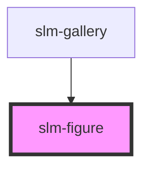

# slm-figure

<!-- Auto Generated Below -->

## Properties

| Property         | Attribute          | Description | Type     | Default     |
| ---------------- | ------------------ | ----------- | -------- | ----------- |
| `figPath`        | `fig-path`         |             | `string` | `undefined` |
| `figPlaceHolder` | `fig-place-holder` |             | `string` | `undefined` |
| `figTitle`       | `fig-title`        |             | `string` | `undefined` |

## Dependencies

### Used by

 - [slm-gallery](../gallery)

### Graph

----------------------------------------------

*Built with [StencilJS](https://stenciljs.com/)*
